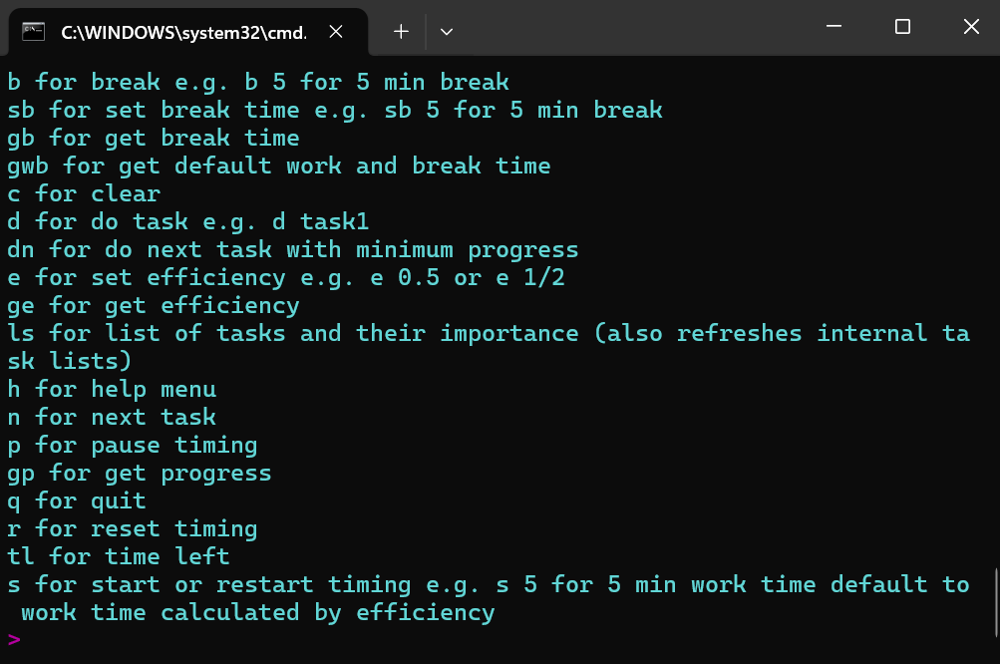

# Week Planner

A simple, terminal-based task management and productivity tool with an adaptive Pomodoro-style timer written in Python.



## Overview

WeekPlanner helps you manage tasks with importance-based prioritization, tracks your progress, and uses an efficiency-based work/break ratio to structure your time. It combines traditional task management with adaptive time tracking to help you stay productive throughout your week.

## Features

- **Task Management**: Add, list, and select tasks with custom importance levels
- **Progress Tracking**: Monitor completion based on importance-weighted progress
- **Adaptive Pomodoro Timer**: Automatically adjusts work and break times based on your efficiency
- **Break Time Accumulator**: Builds up break time as you complete work sessions
- **Colorful Terminal Output**: Easy-to-read colored interface with visual feedback
- **Audio Alerts**: Sound notifications when timers complete (Windows)

## Installation

### Requirements

- Python 3.x
- Windows OS (uses `winsound` for audio alerts)
- No external libraries required

### Setup

1. Clone the repository:
```bash
git clone https://github.com/mrgyularabai/Week-Planner.git
cd Week-Planner
```

2. Run the script:
```bash
python weekplanner.py
```

Tasks are automatically stored in `tasks.txt` in the same directory as the script.

## Usage

### Task File Format

The `tasks.txt` file stores one task per line with the following format:

```
Task name with spaces importance_value
```

Example:
```
Study for exam 3.5
Clean the kitchen 1.0
Write report 4.2
```

The importance value is a positive float number (higher = more important).

### Commands

| Command | Description | Example |
|---------|-------------|---------|
| `a` / `add` | Add a new task | `a Write blog post 2.5` |
| `ls` | List all tasks and refresh internal lists | `ls` |
| `d` taskname | Start working on a specific task | `d Write blog post` |
| `dn` | Do next task (lowest progress, random if tie) | `dn` |
| `n` | Show next task without starting | `n` |
| `e` value | Set efficiency (0–1) or ratio (e.g. 1/2) | `e 0.8` or `e 4/5` |
| `ge` | Get current efficiency | `ge` |
| `s` [minutes] | Start/restart timer (defaults to calculated work time) | `s` or `s 25` |
| `p` | Pause timer | `p` |
| `r` | Reset timer | `r` |
| `tl` | Show time left | `tl` |
| `b` [minutes] | Start break (defaults to accumulated break time) | `b` or `b 10` |
| `sb` minutes | Set accumulated break time | `sb 15` |
| `gb` | Get current accumulated break time | `gb` |
| `gwb` | Get default work & break times based on efficiency | `gwb` |
| `gp` | Show progress for all tasks | `gp` |
| `c` | Clear screen | `c` |
| `h` | Show help menu | `h` |
| `q` | Quit the application | `q` |

### How the Timer & Efficiency System Works

The app uses an efficiency factor (default: 0.8) to automatically calculate optimal work/break ratios.

**Formula:**
- Rest time = max(5, (1/efficiency - 1) × 20) minutes
- Work time = rest_time × (efficiency / (1 - efficiency)) minutes

**Example with efficiency = 0.8:**
- Rest time ≈ 5 minutes
- Work time ≈ 20 minutes

Each time you finish a work session, the corresponding break time is automatically added to your break bank. This ensures you always have accumulated breaks available when you need them.

### Progress Tracking

Tasks are tracked based on their importance level. Each time you complete a work session on a task, its progress increases by `1 / importance`. This means more important tasks require more work sessions to complete.

When using the `dn` (do next) command, the system prioritizes tasks with:
1. Lower progress (incomplete tasks)
2. Higher importance (if progress is equal)
3. Random selection (if both progress and importance are equal)

## Example Workflow

1. Add your tasks for the week:
```bash
> a Write project proposal 4.0
> a Review pull requests 2.5
> a Update documentation 1.5
```

2. List your tasks to see what's on your plate:
```bash
> ls
```

3. Work on the highest priority incomplete task:
```bash
> dn
```

4. The app will show your task and ask for confirmation. Start working!

5. When your work session ends, you'll hear an alert. Take your accumulated break:
```bash
> b
```

6. Check your progress anytime:
```bash
> gp
```

## Customization

### Adjusting Efficiency

You can adjust your efficiency level at any time. Lower efficiency means longer breaks relative to work time:

```bash
> e 0.5    # More breaks
> e 0.9    # Fewer breaks
> e 3/4    # Use fractions
```

### Manual Timer Control

Override the automatic timer with custom durations:

```bash
> s 30     # Work for 30 minutes
> b 15     # Take a 15-minute break
```

## License

This project is licensed under the MIT License. See the [LICENSE](LICENSE) file for details.

## Author

**Gyula Rabai**
- Website: [gyularabai.com](https://gyularabai.com)


## Contributing

Contributions, issues, and feature requests are welcome! Feel free to check the [issues page](https://github.com/mrgyularabai/Week-Planner/issues).

## Acknowledgments

This project is part of a collection of projects by Gyula Rabai exploring various programming concepts and productivity tools.
